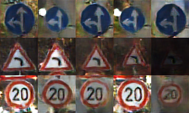

# BAGAN
Keras implementation of [Balancing GAN (BAGAN)](https://arxiv.org/abs/1803.09655) applied to the MNIST example.

The framework is meant as a tool for data augmentation for imbalanced image-classification datasets where some classes are under represented.
The generative model applied to sample new images for the minority class is trained in three steps: a) training a preliminary autoencoder, b) initialization of the generative adversarial framework by means of the pre-trained autoencoder modules, and c) fine tuning of the generative model in adversarial mode.

Along these steps, the generative model learns from all available data including minority and majority classes. This enables the model to automatically figuring out if and which features from over-represented classes can be used to draw new images for under-represented classes.
For example, when considering a traffic sign recognition problem, all warning signs share the same external triangular shape.
BAGAN can easily learn the triangular shape from any warning sign in the majority classes and reuse this pattern to draw other under-represented warning signs.

The application of this approach toward fairness enhancement and bias mitigation in deep-learning AI systems is currently an active research topic.

## Example results

The [German Traffic Sign Recognition benchmark](http://benchmark.ini.rub.de/) is an example of imbalanced dataset composed of 43 classes, where the minority class appears 210 times, whereas the majority class 2250 times.

Here we show representative sample images generated with BAGAN for the three least represented classes.

Refer to the original work (https://arxiv.org/abs/1803.09655) for a comparison to other state of the art approaches.

The code in this repository executes on the [MNIST dataset](http://yann.lecun.com/exdb/mnist/). The dataset is originally balanced and, before to train BAGAN, we force class imbalance by selecting a target class and removing from the training dataset a significant portion of its instances.
The following figure shows 0-image samples generated when dropping 97.5\% of 0-images from the training set before training.

## Running the MNIST example

This software has been tested on `tensorflow-1.5.0`.

To execute BAGAN for the MNIST example, run the command:
`./run.sh`

A directory named: `res_MNIST_dmode_uniform_gmode_uniform_unbalance_0.05_epochs_150_lr_0.000050_seed_0` will be generated and results will be stored there.

After the training, you will find in that directory a set of `h5` files stroging the model weights, a set of `csv` files storing the loss functions measured for each epoch, a set of `npy` files storing means and covariances distributions for the class-conditional latent-vector generator, a set of `cmp_class_<X>_epoch_<Y>.png` showing example images obtained during training.

The file `cmp_class_<X>_epoch_<Y>.png` shows images obtained when training the GAN for Y epochs and considering class X as minority class. There are three row per class: 1) real samples, 2) autoencoded reconstructed samples, 3) randomly-generated samples.
Note that in BAGAN, after the initial autoencored training, the generative model is trained in adversarial mode and the autoencoder loss is no longer taken into account. Thus, during the adversarial training the autoencoded images may start to deteriorate (row 2 may no longer match row 1), whereas the generated images (row 3) will improve quality.

For more information about available execution options:
`python ./bagan_train.py --help`

